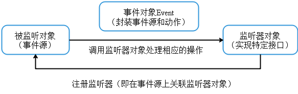
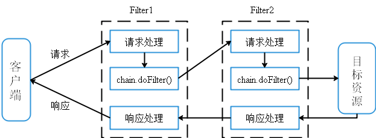

[TOC]

### Servlet基础

#### Servlet概述

Servlet（Server Applet）是Java Servlet的简称，称为小服务程序或服务连接器，用Java编写的服务器端程序，主要功能在于交互式地浏览和修改数据，生成动态Web内容。Servlet应用无法独立运行，必须运行在Servlet容器中，Servlet容器将用户的请求传递给Servlet应用，并将结果返回给用户。

#### Servlet运行过程

1. Web服务器检查是否已经装载并创建了Servlet对象，如果已经存在则直接执行第四步

2. 装载并创建该Servlet的一个实例对象。

3. 调用Servlet实例对象的`init()`方法

4. 调用Servlet实例对象的`service()`方法

     - 创建一个用于封装HTTP请求消息的`HttpServletRequest`对象
     - 创建一个代表HTTP响应消息的`HttpServletResponse`对象
     - 调用HttpServlet的`service()`方法并将请求和响应对象作为参数传递进去

5. WEB应用程序被停止或重新启动之前，将调用Servlet的`destroy()`方法并卸载Servlet

  

<center>servlet运行过程</center>

#### Servlet生命周期

- 加载和实例化：由Servlet容器完成
- 初始化：实例化Servlet后会调用`init()`方法
- 处理用户请求：`service()`方法（doGet或doPost）
- 销毁：销毁之前会调用`destroy()`方法

补充：

在web.xml配置文件中，对每个servlet都有`<load-on-startup></load-on-startup>`这一配置项，它的含义是：标记容器是否在启动的时候就加载这个servlet。当值为0或者大于0时，表示容器在应用启动时就加载这个servlet；当是一个负数时或者没有指定时，则指示容器在该servlet被选择时才加载。正数的值越小，启动该servlet的优先级越高。

#### Servlet接口及其实现类

- Servlet接口：定义了Servlet和Servlet容器之间的契约，方法如下：
  - `init()`：在Servlet实例化后，调用`service()`前调用的初始化方法，只会被调用一次。
  - `service()`：调用`service()`方法响应用户请求。
  - `destroy()`：当一个Servlet被去除时，Servlet容器将会调用`destroy()`方法，该方法只会被调用一次。
  - `getServletInfo()`：返回Servlet的描述字符串。
  - `getServletConfig`：返回由Servlet容器传给`init()`方法的ServletConfig。

    ```java
    public abstract void init(ServletConfig config) throws ServletException;
    public abstract ServletConfig getServletConfig();
    public abstract String getServletInfo(); 
    public abstract void service(ServletRequest request, ServletResponse 				response) 	throws ServletException, IOException;
    public abstract void destroy();
    ```

- `GenericServlet`抽象类：实现了Servlet接口，未指定协议的Servlet，实现了接口中的`init()`,

  `getServletConfig()`,` getServletInfo()`,`destroy()`方法。

- `HttpServlet`抽象类： 继承`GenericServlet`抽象类，基于http协议的Servlet，重写了`service()`方法并对其进行重载，在`service()`方法中将`ServletRequest`对象包装成`HttpServletRequest`对象，将`ServletResponse`包装成`HttpServletResponse`对象，并调用了重载方法。在重载方法中调用了`doGet()`、`doPost()`等方法，当自定义Servlet类时只需要继承`HttpServlet`类，重写`doGet()`等方法即可。


#### ServletConfig和ServletContext

  - `ServletConfig`：用于封装**servlet的配置信息**。从一个servlet被实例化后，对任何客户端在任何时候访问有效，但仅对servlet自身有效，一个servlet的ServletConfig对象不能被另一个servlet访问。`ServletConfig`常用方法如下：

    ```java
    // 获取Servlet名称
    public abstract String getServletName();
    // 获取ServletContext
    public abstract ServletContext getServletContext();
    // 获取所有初始化参数名称
    public abstract Enumeration<String> getInitParameterNames();
    // 根据初始化参数名称获取初始化参数值  
    public abstract String getInitParameter(String paramString);
    ```

    配置Servlet初始化参数：

    ```xml
     <servlet>
        <servlet-name>MyFirstServlet</servlet-name>
        <servlet-class>senney.javaweb.FirstServlet</servlet-class>
        <!-- 配置Servlet初始化参数 可以使用ServletConfig对象获取-->
         <init-param>
    			<param-name>name_01</param-name>
    			<param-value>value_01</param-value>
    		</init-param>
    		<init-param>
    			<param-name>name_02</param-name>
    			<param-value>value_02</param-value>
    		</init-param>
        <init-param>
        	<param-name>userName</param-name>
        	<param-value>senney</param-value>
        </init-param>
        <!-- 配置Servlet初始化参数 -->
      </servlet>
    ```

  - `ServletContext`：servlet容器在启动时会加载web应用，并为每个web应用创建**唯一**的`Servletcontext`对象，可以把`ServletContext`看成是一个Web应用的服务器端组件的共享内存，在`ServletContext`中可以存放共享数据。`ServletContext`对象是真正的一个**全局对象**，凡是web容器中的Servlet都可以访问，`ServletContext`常用方法如下

    ```java
    // 根据全局初始化参数名称获取初始化参数值
    public abstract String getInitParameter(String paramString);
    // 获取所有全局初始化参数名称 
    public abstract Enumeration<String> getInitParameterNames();
    // 读取数据
    public abstract Object getAttribute(String paramString);
    // 保存数据
    public abstract void setAttribute(String paramString, Object paramObject);
    // 读取资源文件
    public abstract InputStream getResourceAsStream(String paramString);
    // 页面转发
    public abstract RequestDispatcher getRequestDispatcher(String paramString);
    ```

    配置Web程序应用初始化参数：

    ```xml
    <!-- 与Servlet节点层级相同  -->  
    <context-param>
      	<param-name>application_name</param-name>
      	<param-value>Hello_Servlet</param-value>
      </context-param>
    ```

  #### ServletRequest和ServletResponse

  - ServletRequest：封装了http请求的相关信息，常用方法如下：

  ```java
  // 读取数据
  public abstract Object getAttribute(String paramString);
  // 保存数据
  public abstract void setAttribute(String paramString, Object paramObject);
  // 获取请求主体的MIME类型
  public abstract String getContentType();
  // 获取地址栏或form表单请求参数
  public abstract String getParameter(String paramString);
  ```
  - ServletResponse：Servlet响应，常用方法如下：
  ```java
  public abstract void setContentType(String paramString);
  public abstract void setCharacterEncoding(String paramString);
  public abstract ServletOutputStream getOutputStream() throws IOException;
  public abstract PrintWriter getWriter() throws IOException;
  ```

#### 虚拟路径的配置

- 配置方式

  1. 使用注解配置

     ```java
     // 简单形式
     @WebServlet("/Hello")
     // 复杂形式
     @WebServlet(name = "Hello", urlPatterns="/Hello",loadOnStartup=1,initParams={@WebInitParam(name ="name", value ="senney")})
     ```

  2. 使用web.xml进行配置

     ```xml
       <servlet>
       	<servlet-name>Hello</servlet-name>
       	<servlet-class>senney.javaweb.Hello</servlet-class>
       </servlet>
       <servlet-mapping>
       	<servlet-name>Hello</servlet-name>
       	<url-pattern>/Hello</url-pattern>
       </servlet-mapping>
     ```

- url-pattern配置内容

  - 配置全路径，例如 `/Hello`
  - 匹配某个目录 ，例如`/login/*`
  - 匹配指定后缀的文件 ，例如`*.txt`


### 会话管理

#### 会话管理概念

会话可简单理解为：用户开一个浏览器，点击多个超链接，访问服务器多个web资源，然后关闭浏览器，整个过程称为一个会话。HTTP协议是无状态的，Web服务器无法区分一个HTTP请求是否为第一次访问，也无法记录多次请求响应之间的联系，因此需要通过会话管理或会话跟踪记录多次请求响应之间的联系(“保持状态”则是指通信的一方能够把一系列的消息关联起来，使得消息之间可以互相依赖)。

cookie与session区别：具体来说**cookie机制**采用的是在**客户端**保持状态的方案，而**session机制**采用的是在**服务器端**保持状态的方案。同时我们也看到，由于采用服务器端保持状态的方案在客户端也需要保存一个标识，所以session机制可能需要借助于cookie机制来达到保存标识的目的(SessionID存于cookie中)，但实际上它还有其他选择。

#### 会话管理实现技术

- url重写

  将一个或多个token添加到URL的查询字符串中，每个token通常为key=value形式，例如：

  ```http
  url?key1=value1&key2=value2&key3=value3...
  ```

- 隐藏域

  使用隐藏域来保持状态类似于URL重写技术，但不是将值附加到URL上，而是放到HTML表单的隐藏域中。当表单提交时，隐藏域的值也同时提交到服务器端。隐藏域技术仅在网页有表单时有效。该技术相对于URL重写的优势在于：没有字符数限制，同时无须额外的编码。但该技术同URL一样，不适合跨越多个页面。

- Cookie

  - 工作流程：

    1.  servlet创建cookie，保存少量数据（键值对形式保存数据），发送浏览器。
    2. 浏览器获得服务器发送的cookie数据，将自动的保存到浏览器端。
    3. 下次访问时，浏览器将自动携带cookie数据发送给服务器。

  - 相关API

    ```java
    // 从request中获取cookie数据
    public abstract Cookie[] getCookies(); (HttpServletRequest)
    // 新建cookie
    public Cookie(String name, String value);
    // 设置有效时间
    public void setMaxAge(int expiry);
    // 获取cookie的键
    public String getName();
    // 修改cookie的值
    public void setValue(String newValue); 
    // 将cookie加入response中
    public abstract void addCookie(Cookie paramCookie); (HttpServletResponse)
    ```

- HttpSession

  - session原理分析

    当用户在第一次访问网站时，服务器将会为用户自动创建一个session，同时会产生一个session标识(SessionID)，并将SessionID保存在cookie中作为响应返回给客户端，当用户再次访问时会携带SessionID，服务器将根据SessionID找到对应的session。

  - 相关API

    ```java
    // 获取session对象(如果request没有sessionID，则新建session对象)
    public abstract HttpSession getSession();  (HttpServletRequest)
    // 保存数据
    public abstract void setAttribute(String paramString, Object paramObject);
    // 获取指定数据
    public abstract Object getAttribute(String paramString);
    // 获取所有数据
    public abstract Enumeration<String> getAttributeNames();
    // 获取session标识
    public abstract String getId();
    // 销毁session对象
    public abstract void invalidate();
    // 设置过期时间
    public abstract void setMaxInactiveInterval(int paramInt);
    ```

  - session生命周期

    - 创建：第一次调用`getSession()`方法
    - 销毁：
      1. 超时，默认30分钟
      2. 执行api：
         - `invalidate()`: 销毁session对象
         - `setMaxInactiveInterval(int interval)`: 设置有效时间，单位秒
      3. 服务器非正常关闭

  - 备注

    - 当在同一个浏览器中同时打开多个标签，发送同一个请求或不同的请求，仍是同一个session;

    - 当不在同一个窗口中打开相同的浏览器时，发送请求，仍是同一个session;

    - 当使用不同的浏览器时，发送请求，即使发送相同的请求，是不同的session;

    - 当把当前某个浏览器的窗口全关闭，再打开，发起相同的请求时，是不同的session，但是它和session的生命周期是没有关系的。


#### 页面跳转

- 请求转发：将客户端的请求转发到另外一个Servlet或者JSP页面。

  ```java
  // 通过调用HttpServletRequest对象的getRequestDispatcher方法获取RequestDispatcher对象
  public abstract RequestDispatcher getRequestDispatcher(String paramString);
  // 调用 RequestDispatcher对象的forward方法可以实现请求转发  
  public abstract void forward(ServletRequest paramServletRequest, ServletResponse paramServletResponse) throws ServletException, IOException;
  ```

- 请求重定向：让浏览器重新发生请求，但是将请求的是另外一个Servlet。

  ```java
  // 通过调用HttpServletResponse对象的sendRedirect方法可以实现请求重定向
  public abstract void sendRedirect(String paramString) throws IOException;
  ```


- 请求转发与请求重定向之间的区别：
  1. 请求转发只发生一次http请求，而重定向发生了两次http请求；
  2. 请求转发可以在两个页面上通过request传递参数，而重定向不能传递参数；
  3. 请求转发不改变地址栏URL，请求重定向会改变地址栏URL。
  4. 请求转发只能将请求转发给同一个WEB应用中的组件；而请求重定向不仅可以重定向到当前应用程序中的其他资源，还可以重定向到同一个站点上的其他应用程序中的资源，甚至是使用绝对URL重定向到其他站点的资源。

#### 数据共享

- 在客户端页面和服务器端程序(Servlet)之间，通过请求(request)的`getParameter()`方法共享数据
- 在请求(request)与请求(request)之间，通过request的`setAttribute()`和`getAttribute()`方法共享数据（注意：只能应用在请求转发时共享数据）
- 在同一个Servlet对象中，可以通过`ServletConfig`对象共享数据
- 在整个Web应用程序范围内，可以通过`ServletContext`对象的`setAttribute()`和`getAttribute()`方法共享数据

### 监听器

#### 监听器的功能及原理

监听器主要用于**负责监听Web应用程序的各种操作**，监听器就是一个实现特定接口的普通java程序，这个程序专门用于**监听另一个java对象的方法调用或属性改变**。当被监听对象发生上述事件后，监听器对应的 方法将立即被执行。被监听对象又被称为事件源，当事件源发生某个动作的时候，它会调用事件监听器的方法，并在调用事件监听器方法的时候把事件对象传递进去。因此，程序可以在监听器中通过事件对象获取得到事件源，从而对事件源进行操作！监听器运行示意图如下：




#### 监听器的分类

  - 根据监听对象的类型和作用范围可以将监听器分为三大类：

    1. ServletContext

       ServletContext对象是application范围内的对象，与ServletContext对象相关的监听器接口如下：

       - ServletContextListener: 监听ServletContext生命周期事件

         ```java
         // 监听ServletContext的创建事件 
         public void contextInitialized(ServletContextEvent sce) {}
         // 监听ServletContext的销毁事件
         public void contextDestroyed(ServletContextEvent sce) {}
         // 通过ServletContextEvent事件对象获取ServletContext对象
         public ServletContext getServletContext();
         ```

       - ServletContextAttrubiteListener: 监听ServletContext的属性添加、删除、替换事件

         ```java
         // 监听ServletContext属性的添加事件
         public void attributeAdded(ServletContextAttributeEvent scae) {}
         // 监听ServletContext属性的删除事件
         public void attributeRemoved(ServletContextAttributeEvent scae) {}
         // 监听ServletContext属性的替换事件
         public void attributeReplaced(ServletContextAttributeEvent scae) {}
         
         // 通过ServletContextAttributeEvent事件对象获取事件源属性的名称
         public String getName();
         // 通过ServletContextAttributeEvent事件对象获取事件源属性的名称
         // 发生属性添加事件时为添加的属性值，删除和替换时是之前的属性值（旧值）
         public Object getValue();
         ```

    2. HttpSession

       HttpSession对象是session范围内的对象，与HttpSession对象相关的监听器接口如下：

       - HttpSessionListener: 监听HttpSession的创建、超时和失效事件

         ```java
         // 监听HttpSession的创建事件
         public void sessionCreated(HttpSessionEvent se) {}
         // 监听HttpSession的超时、失效事件
         public void sessionDestroyed(HttpSessionEvent se) {}
         // 通过HttpSessionEvent事件对象获取HttpSession对象
         public HttpSession getSession()
         ```

       - HttpSessionAttributeListener: 监视HttpSession的属性添加、删除和替换事件

         ```java
         // 监听HttpSession属性的添加事件 
         public void attributeAdded(HttpSessionBindingEvent se) {}
         // 监听HttpSession属性的删除事件
         public void attributeRemoved(HttpSessionBindingEvent se) {}
         // 监听HttpSession属性的替换事件
         public void attributeReplaced(HttpSessionBindingEvent se) {}
         
         // HttpSessionBindingEvent事件对象常用方法
         public HttpSession getSession();
         public String getName();
         public Object getValue();
         ```

       - HttpSessionActivationListener: 在HttpSession激活或者失效时被调用（session对象转存到其它容器上）

         ```java
         public void sessionWillPassivate(HttpSessionEvent se) {}
         public void sessionDidActivate(HttpSessionEvent se) {}
         ```

       - HttpSessionBindingListener: 可以通过实现这个接口来保持HttpSession范围的属性。当有属性从HttpSession添加或者删除时，HttpSessionBindingListener接口能够做出响应，这个接口不需要配置，可以直接使用。

         ```java
         public void valueBound(HttpSessionBindingEvent event) {}
         public void valueUnbound(HttpSessionBindingEvent event) {}
         ```

    3. ServletRequest

       ServletRequest对象是request范围内的对象，与ServletRequest对象相关的监听器接口如下：

       - ServletRequestListener: 监听ServletRequest的创建或者删除

         ```java
         // ServletRequestListener对象方法
         public void requestDestroyed(ServletRequestEvent sre) {}
         public void requestInitialized(ServletRequestEvent sre) {}
         // ServletRequestEvent事件对象常用方法
         public ServletRequest getServletRequest();
         public ServletContext getServletContext();
         ```

       - ServletRequestAttributeListener: 监听ServletRequest的属性值添加、删除、修改事件

         ```java
         //ServletRequestAttributeListener对象方法
         public void attributeAdded(ServletRequestAttributeEvent srae) {}
         public void attributeRemoved(ServletRequestAttributeEvent srae) {}
         public void attributeReplaced(ServletRequestAttributeEvent srae) {}
         // ServletRequestAttributeEvent事件对象常用方法
         public String getName();
         public Object getValue();
         ```

       - AsyncListener
#### 监听器的注册

    - 使用注解的方式进行注册，例如：`@WebListener`
    
    - 使用部署描述文档(web.xml)进行注册
    
      ```xml
      <listener>
      	<listener-class>senney.javaweb.listener.ListenerDemo</listener-class>
      </listener>
      ```

### 过滤器

#### 过滤器的概念

  过滤器(Filter)是拦截Request请求的对象：在用户的请求访问资源前处理Request以及Response，它用于编码的过滤、日志记录、加解密、Session检查、图像文件保护等。过滤器工作流程示意图如下：

  

#### 过滤器的实现

  Filter的实现必须继承`javax.servlet.Filter`接口，其中，`javax.servlet.Filter`接口包括了以下三个方法。在Filter的`doFilter()`实现中，需要调用FilterChain的`doFilter()`方法，在调用FilterChain的`doFilter()`方法之前会对request进行处理，在FilterChain的`doFilter()`方法之后会对返回的资源进行处理。

  ```java
  //初始化Filter（只调用一次）
  public void init(FilterConfig filterConfig)throws ServletException{} 
  // Filter核心方法
  public abstract void doFilter(ServletRequest request, ServletResponse response, 	FilterChain chain) throws IOException, ServletException;
  public void destroy() {}
  ```

#### 过滤器的注册

  - 通过注解进行注册，例如`@WebFilter(/ListServlet)`

  - 通过部署描述文档(web.xml)进行注册

    ```xml
     <filter>
        <filter-name>CharsetFilter</filter-name>
        <filter-class>senney.javaweb.filterTest.CharacterEncoding</filter-class>
      </filter>
      <filter-mapping>
        <filter-name>CharsetFilter</filter-name>
        <url-pattern>/ListServlet</url-pattern>
      </filter-mapping>
    ```

- 过滤器执行顺序

  若果有多个Filter应用于同一个资源，这时就需要使用部署描述文档来管理Filter，过滤器的加载顺序为部署描述文档中Filter注册顺序的倒序，执行顺序为部署描述文档中Filter注册顺序的正序。