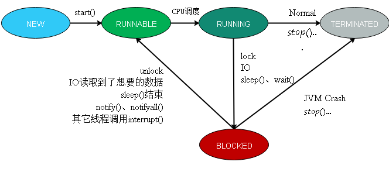
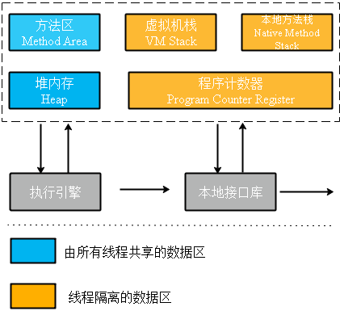

[TOC]


### 进程与线程介绍

* 进程：进程(Process)是操作系统结构的基础，是一次程序的执行；对计算机而言，一个任务就是一个进程；是一个程序及其数据在处理机上顺序执行时所发生的活动；是程序在一个数据集合上运行的过程，**它是系统进行资源分配和调度的一个独立单位。**

* 线程：线程是比进程更小的执行单位，线程是在进程的基础之上进行的进一步划分，线程可以理解成是在进程中独立运行的子任务。

  注意事项：所有的线程与进程是一样的，都必须轮流去抢占资源，所以多线程的执行应该是多个线程彼此交替执行。在使用多线程技术时，代码的运行结果与代码执行顺序或调用顺序是无关的。


### 线程的生命周期

  任何线程一般都具有**5种状态**，即创建、就绪、运行、堵塞和终止，如图1所示。

1. 创建状态(**NEW**)：在程序中用构造方法创建一个线程对象后，新的线程对象便处于新建状态，此时，它已经拥有相应的内存空间和其他资源，但还处于不可运行状态。
2. 就绪状态(**RUNNABLE**)：新建线程对象后，调用线程的`start()`方法就可以启动线程。当线程启动时，线程就进入就绪状态。此时，线程将进入线程队列排队，等待CPU服务，这表明它已经**具备了运行条件**。
3. 运行状态(**RUNNING**)：当就绪状态的线程被调用并获得处理器资源时，线程就进入了运行状态，自动调用该线程对象的`run()`方法。该状态在调用`sleep()`、`wait()`等方法后、或者进行某个阻塞的IO操作、又或者获取某个锁资源将会进入**BLOCKED**状态；由于CPU的调度器轮询使得该线程放弃执行或者线程主动调用`yield()`方法都会使得线程进入**RUNNABLE**状态；通过判断某个逻辑标识或者调用`stop()`方法*（不推荐）*会使得线程直接进入**TERMINATED**状态。
4. 堵塞状态(**BLOCKED**)：一个正在执行的线程在某些特殊情况下，如被人为挂起或需要执行耗时的输入输出时，将让出CPU并暂时中止自己的运行，进入堵塞状态。
5. 中止状态(**TERMINATED**)：线程调用`stop()`方法时或`run()`方法执行结束后，就处于终止状态。


<center>图1 线程状态</center>

### 多线程的实现

* 多线程的实现：创建线程只有一种方式，那就是构造`Thread`类或其子类，而实现线程的执行单元有两种方式：重写`Thread`类的`run()`方法；实现`Runnable`接口的`run()`方法，并将`Runnable`实例用作构造`Thread`的参数；

  - 继承`Thread`类，重写`run()`方法

    `java.lang.Thread`是一个负责线程操作的类，任何类只需要继承`Thread`类就可以成为一个线程的主类。线程启动的主方法需要覆写`Thread`类中的`run()`方法实现。如果直接调用`run()`方法，并不能启动多线程，多线程启动的唯一方法就是`Thread`类中的`start()`方法。

    ```java
     //实例化继承Thread类的自定义子类对象
     MyThread mt = new MyThread();
     //调用start()启动线程
     mt.start();
    ```

  - 实现`Runnable`接口，将其作为参数传入`Thread`类的构造函数中

    在`Runnable`接口也定义了`run()`方法，线程的主类只需要覆写此方法即可。`Thread`类的构造方法中可以接收一个`Runnable`对象，用`Thread`类包装一个自定义的`Runnable`接口实例对象，调用`start()`方法就可以实现多线程。

    ```java
    //实例化实现Runnable接口的类对象
    RunnableImp imp = new RunnableImp();
    //实例化Thread对象，接收Runnable的实现类对象
    Thread t =new Thread(imp);
    //调用Thread的start()，启动多线程
    t.start();
    ```

  - 实现`Callable`接口，包装成`FutureTask`对象传入`Thread`类构造函数中

    `Runnable`接口里面的	`run()`方法不能返回操作结果。而`java.util.concurrent.Callable`接口的`call()`方法在操作完成后可以直接返回一个具体的操作数据。利用`java.util.concurrent.FutureTask`类实现`Callable`接口的子类包装，由于`FutureTask`是`Runnable`接口的子类，所以可以利用`Thread`类的`start()`方法启动多线程，当线程执行完毕之后，可以利用`Funture`接口中`get()`方法返回线程执行的结果。

    ```java
    //实例化Callable接口的实现类对象
    CallableImp imp = new CallableImp();
    //实例化FutureTask对象，接收Callable接口的实现类对象
    FutureTask<String> task = new FutureTask<String>(imp);
    //实例化Thread对象，接收FutureTask类对象，调用start()启动多线程
    new Thread(task).start();
    //利用FutureTask对象的get()方法获取线程执行结果
    System.out.println(task.get());
    ```


* `start()`与模板设计模式

  在执行`Thread`类的`start()`方法时将会调用`run()`方法，而且同一线程不能两次被启动，生命周期结束的线程也不能被启动（激活），否则会抛出`IllegalThreadStateException`异常。

  模板设计模式：父类定义一个操作中的算法结构代码，而将一些具体实现延迟到子类中。 模板方法使得子类可以不改变**一个算法**的结构即可重定义该算法的某些特定步骤。

* `Runnable`接口与策略模式

  `Runnable`接口只定义了一个无参数无返回值的`run()`方法，通过使用`Runnable`接口构造`Thread`类的实例同样可以将线程本身的控制逻辑和业务逻辑的运行分离开来，达到职责分明、功能单一的原则。`Thread`类的`run()`方法不能共享，而`Runnable`没有这个限制，可以使用同一个`Runnable`的实例构造不同的`Thread` 实例。

  策略模式：  策略模式定义了**一系列的算法**，并将每一个算法**封装起**来，而且使它们还可以**相互替换**，策略模式让算法独立于使用它的客户而独立变化。略模式使这些算法在客户端调用它们的时候能够**互不影响**地变化。

  模板设计模式与策略模式的区别：

  > > Template methods use inheritance to vary part of an algorithm. Strategies use delegation to vary the entire algorithm.


### Thread构造函数

- 线程的命名

  如果没有为线程显式地指定一个名字，那么线程将会以“Thread-”为前缀与一个自增数字组合作为名字。可以通过使用构造函数或者`setName()`方法为线程命名。在使用`setName()`为线程命名时必须在线程启动之前，当线程启动之后，名字将不再被修改。

  ```java
  public Thread(String name);
  public Thread(ThreadGroup group, String name);
  public Thread(Runnable target, String name);
  public Thread(ThreadGroup group, Runnable target, String name);
  public Thread(ThreadGroup group, Runnable target, String name,long stackSize); 
  public final synchronized void setName(String name); 
  ```

- 线程的父子关系

  在为调用`start()`方法之前，线程只能算是一个`Thread`的实例，而该线程的父线程则创建该线程的线程，可以使用`currentThread()`方法获得。

- Thread 与 ThreadGroup

  在`Thread`的构造函数中，可以显示地指定线程的Group，如果没有显示指定一个`ThreadGroup`，那么子线程将会被加入父线程所在的线程组。

- Thread与JVM虚拟机栈

  Thread 与 Stacksize: stacksize越大则代表着正在线程内方法调用递归的深度就越深，stacksize越小则代表着可以创建的线程数量越多。

  JVM内存结构如图2所示：

  

  <center>图2 JVM内存结构</center>

  - 程序计数器：用于存放当前线程接下来要执行的字节码指令、分支、循环、跳转、异常处理等信息，线程私有，各线程互不影响。
  - java虚拟机栈：java虚拟机栈是线程私有的，生命周期与线程相同，栈中又会包含多个栈帧，栈帧主要用于存放局部变量表、操作栈、动态链接、方法出口等信息，方法的调用对应着栈帧在虚拟机栈中的压栈和弹栈的过程。栈深度大于虚拟机允许的深度：`StackOverflowError`；如果虚拟机栈允许动态扩展，扩展时无法申请到足够的内存：`OutOfMemoryError`
  - 本地方法栈：java中提供了调用本地方法的接口(Java Native Interface，JNI)，JVM为本地方法所划分的内存区域便是本地方法栈，线程私有。
  - 堆内存：JVM中最大的一块区域，所有线程共享，java在运行期间创建的所有对象几乎都存放在该内存区域。堆是垃圾收集器管理的主要区域。因此也叫“GC堆”。如果在堆中没有内存完成实例分配，并且堆也无法再扩展： `OutOfMemoryError`
  - 方法区：所有线程共享的区域，它用于存储已被虚拟机加载的类信息、常量、静态变量、即时编译器编译后的代码等数据。方法区这个存储区域也属于java堆中的一部分，它存储的信息相对比较稳定，不会频繁地被GC回收,因此又被称为“持久代”、“永久区”（jdk1.8之后，永久区被元空间替代），但是它仍然占用了Java堆的空间，所以仍然会被JVM的GC回收器来管理。

- 守护线程：在正常情况下，若JVM中没有一个非守护线程，则JVM的进程会退出，守护线程具备自动结束生命周期的特性。守护线程通常用于执行一些后台任务，如垃圾回收等。


### Thread API 详细介绍

* `sleep()`: 使当前线程进行指定毫秒数的休眠，暂停执行。在JDK1.5之后可以使用枚举`TimeUnit`实现线程休眠。

  ```java
  TimeUnit.HOURS.sleep(3);// 使线程休眠3小时
  ```

  ```java
  // sleep方法签名
  public static native void sleep(long millis) throws InterruptedException;
  public static void sleep(long millis, int nanos)throws InterruptedException;
  ```

* `yield()`：提醒调度器愿意放弃当前的CPU资源，如果CPU资源不紧张，则会忽略这种提醒(hint)，调用`yield()`方法会使当前线程从RUNNING状态切换到RUNNABLE状态。

* `setPriority()`/`getPriority()`：设置/获取线程的优先级。设置线程优先级也是一个提醒(hint)操作，如果CPU比较忙，设置优先级可能会获取更多的CPU时间片，否则几乎不会有任何作用。哪个线程的优先级高，哪个线程就**有可能**会被先执行。

  ```java
  // 获取线程的优先级
  public final int getPriority() 
  // 设置线程的优先级
  public final void setPriority(int newPriority)
  // 线程最低优先级
  public final static int MIN_PRIORITY = 1;
  // 线程正常优先级(main的优先级)
  public final static int NORM_PRIORITY = 5;
  // 线程最高优先级
  public final static int MAX_PRIORITY = 10;
  ```

* `getId()`：获取线程的唯一ID

* `currentThread()`：返回当前执行线程的引用

  ```java
  public static native Thread currentThread();
  ```

* `getContextClassLoader()`/`setContextClassLoader()`：获取/设置线程上下文的类加载器

  ```java
  public ClassLoader getContextClassLoader();
  public void setContextClassLoader(ClassLoader cl);
  ```

* `interrupt()`：中断线程

  - `interrupt()`：调用`Object`的`wait()`方法、`Thread`的`sleep()`方法、`Thread`的`join()`方法、`InterruptibleChannel`的io操作或者`Selector`的`wakeup()`方法等都会使得当前线程进入阻塞状态。而调用当前线程的`interrupt()`方法可以打断阻塞。一旦线程在阻塞的情况下被打断，都会抛出一个`InterruptedException`异常。

    在线程内部存在一个中断标识，如果线程调用了`interrupt()`方法，则中断标识会被设置为`true`，但如果该线程处于阻塞状态时，调用`interrupt()`方法会使得中断标识被清除(`false`)，同时抛出一个`InterruptedException`异常。对终止状态的线程进行中断操作将会被忽略。

  - `isInterrupted()`：判断当前线程是否被中断。

  - `interrupted()`：静态方法，用于判断当前线程是否曾被中断。如果当前线程被打断了，那么第一次调用`interrupted()`方法会返回`true`，同时擦除中断标识，之后再调用`interrupted()`方法都会返回`false`，除非该线程再次被中断过。

  ```java
  public void interrupt();
  public boolean isInterrupted();
  public static boolean interrupted(); 
  ```

* `join()`：线程的串行化

  `join`某个线程A会使得当前线程B进入等待状态，直到线程A结束生命周期或者到达给定的时间，在此期间线程B处于阻塞状态。

* 关闭线程

  - 正常关闭
    - 线程生命周期正常结束
    - 捕获中断信号关闭线程
    - 使用`volatile`开关控制

  - 异常退出：在线程的执行单元中不允许抛出cheked异常，可以将checked异常封装成unchecked异常(`RuntimeException`)抛出进而结束线程的生命周期。

  - 进程假死：出现某个线程阻塞或者线程死锁等情况……


### 线程安全与数据同步

* 共享资源与数据同步：共享资源指的是多个线程同时对同一份资源进行访问（读写操作），被多个线程访问的资源就称为共享资源，如何保证多个线程访问到的数据是一致的，则被称为数据同步或者资源同步。

* 使用`synchronized`关键字进行数据同步

  `synchronized`关键字可以防止线程干扰和内存一致性错误，如果一个对象对多个线程是可见的，那么该对象的所有读或者写都将通过同步的方式进行，具体表现如下：

  - `synchronized`关键字提供了一种锁的机制，能够确保共享变量的互斥访问，从而防止数据不一致问题的出现。
  - `synchronized`关键字包括`monitor enter`和`monitor exit`两个JVM指令，它能够保证在任何时候任何线程执行到`monitor enter`成功之前都必须从主内存中获取数据，而不是从缓存中，在`monitor exit`运行成功之后，共享变量被更新后的值必须刷入主内存。
  - `synchronized`的指令必须严格遵守java happes-before规则，一个`monitor exit`指令之前必定要有一个`monitor enter`。

  `synchronized`关键字可以通过以下两种方式进行使用。

  - 同步代码块：利用`synchronized`包装的代码块，但是需要指定同步对象，一般设置为`this`。
  - 同步方法：利用`synchronized`定义的方法。

  使用`synchronized`关键字需要注意的问题：

  - 与monitor关联的对象不能为空
  - `synchronized`作用与不能过大，否则容易效率越低，甚至丧失并发优势。
  - 多个线程争抢的monitor关联引用应该是同一个（同一个锁）
  - 避免多个锁的交叉导致死锁现象发生

  `synchronized`关键字提供了一种排他式的数据同步机制，某个线程在获取monitor lock时可能会被阻塞，而这种阻塞有两个很明显的缺陷：第一，无法控制阻塞时长；第二，阻塞不可被中断。

  [this monitor && class monitor](https://docs.oracle.com/javase/tutorial/essential/concurrency/locksync.html)

* `java.util.concurrent.locks.Lock`

  `Lock` 实现提供了比使用`synchronized`方法和语句可获得的更广泛的锁定操作。此实现允许更灵活的结构，可以具有差别很大的属性，可以支持多个相关的`Condition`对象。随着灵活性的增加，也带来了更多的责任。不使用块结构锁就失去了使用 `synchronized` 方法和语句时会出现的锁自动释放功能。锁定和取消锁定出现在不同作用范围中时，必须谨慎地确保保持锁定时所执行的所有代码用 `try-finally` 或 `try-catch` 加以保护，以确保在必要时释放锁，常用实现类有`ReentrantLock`。 

  ```java
    Lock l = ...; 
       l.lock();
       try {
           // access the resource protected by this lock
       } finally {
           l.unlock();
       }
  ```


* 程序死锁：不同的线程都在等待根本不可能释放的资源，从而导致所有的任务都无法继续完成，造成线程的“假死”。
  - 交叉锁可导致程序出现死锁：线程A持有R1的锁等待获取R2的锁，线程B持有R2的锁等待获取R1的锁。
  - 内存不足：当并发请求系统可用内存时，如果此时系统内存不足，则可能会出现死锁的情况。
  - 一问一答式的数据交换：服务端开启了某个端口，等待客户端访问，客户端发送请求立即等待接收，由于某种原因服务端错过了客户端的请求，仍然在等待一问一答式的数据交换，此时服务端和客户端都在等待对方发送数据。
  - 数据库锁：无论是数据库表级别的锁还是行级别的锁，比如某个线程执行`for update`语句退出了事务，其它线程访问该数据库时都将陷入死锁。
  - 文件锁：某线程获得了文件意外退出，其他读取该文件的线程也将会进入死锁直到系统释放文件句柄资源。
  - 死循环引起的死锁（假死）

* volatile关键字

  - 并发编程的三个重要特性
    - 原子性：在一次的操作或多次操作中，要么所有的操作全部都得到了执行并且不会受到任何因素的干扰而中断，要么所有的操作都不执行。
    - 可见性：当一个线程对共享变量进行了修改，那么另外的线程可以立即看到修改后的最新值。
    - 有序性：有序性是指程序代码在执行过程中的先后顺序，由于Java在编译器以及运行期的优化，导致了代码的执行顺序未必就是开发者编写代码时的顺序（指令重排序）。
  - Java内存模型(Java Memory Mode, JMM)与并发三大特性
    - JMM与原子性
      - 多个原子性的操作在一起就不再是原子操作了。
      - 简单的读取与赋值是原子性的，将一个变量赋给另一个变量的操作不是原子性的。
      - JMM只保证了基本读取和赋值的原子性操作，其它的均不保证，如果想要使得某些代码片具备原子性，需要使用`synchronized`关键字或者JUC中的`lock`。`volatile`关键字不具备原子性的语义。
    - JMM与可见性
      - 使用`volatile`关键字，当一个变量使用`volatile`关键字修饰时，对于共享资源的读操作会直接在主内存中进行，对于共享资源的写操作先修改工作内存，但是修改结束后会立刻将其刷新到主内存中。
      - 通过`synchronized`关键字能够保证可见性，`synchronized`关键字能够保证同一时刻只有一个线程获得锁，然后执行同步方法，并且还会确保在锁释放之前，会将对变量的修改刷新到主内存当中。
      - 通过JUC提供的显示所Lock也能够保证可见性，Lock的`lock()`方法能够保证在同一时刻只有一个线程获得锁然后执行同步方法，并且会确保在锁释放(`unlock()`)之前会将对变量的修改刷新到主内存中。
    - JMM与有序性
      - 使用`volatile`关键字来保证有序性
      - 使用`synchronized`关键字来保证有序性
      - 使用显示锁Lock来保证有序性
  - `volatile`关键字的语义
    - 保证了不同线程之间对共享变量操作时的可见性，也就是说当一个线程修改volatile修饰的变量，另一个线程会立即看到最新的值。
    - 禁止对指令进行重排序操作。

* volatile与synchronized的区别

  1. 使用上的区别

     `volatile`关键字只能用于修饰实例变量或者类变量，不能用于修饰方法以及方法参数和局部变量、常量等。`synchronized`关键字不能用于对变量的修饰，只能用于修饰方法或语句块。`volatile`修饰的变量可以为`null`，而`synchronized`关键字同步语句块中的monitor对象不能为`null`。

  2. 对原子性的保证

     `volatile`无法保证原子性，而由于`synchronized`是一种排他机制，因此`synchronized`关键字修饰的同步代码是无法被中途打断的，因此其能够保证代码的原子性。

  3. 对可见性的保证

     两者均可保证共享资源在多线程间的可见性，但实现机制不同。`synchroized`借助JVM指令monitor enter和monitor exit对通过排他的方式使得同步代码串行化，在monitor exit时所有共享资源都会被刷新到主内存中。`volatile`关键字使用机器指令“lock”的方式迫使其它线程工作内存中的数据失效，不得不到主内存中进行再次加载。

  4. 对有序性的保证

     `volatile`关键字禁止JVM编译器以及处理器对其进行重排序，所以它能够保证有序性。虽然`synchronized`关键字所修饰的同步方法也可以保证顺序性，但是这种顺序性是程序串行化换来的，在`synchronized`关键字所修饰的代码块中代码指令也会发生指令重排序的情况。

  5. 其它：`volatile`不会使线程陷入阻塞，而`synchronized`会使线程进入阻塞状态。


### 线程间的通信（等待唤醒机制）

- 同步阻塞消息处理和异步非阻塞消息处理

  - 同步与异步：所谓同步就是一个任务的完成需要依赖另外一个任务时，只有等待被依赖的任务完成后，依赖的任务才能算完成，这是一种可靠的任务序列。。而异步是不需要等待被依赖的任务完成，只是通知被依赖的任务要完成什么工作，依赖的任务也立即执行，只要自己完成了整个任务就算完成了。
  - 阻塞与非阻塞主要是从 CPU 的消耗上来说的，阻塞就是 CPU 停下来等待一个慢的操作完成 CPU 才接着完成其它的事。非阻塞就是在这个慢的操作在执行时 CPU 去干其它别的事，等这个慢的操作完成时，CPU 再接着完成后续的操作。

- 多线程间的通信方式

  参考资料：[JAVA线程与线程、进程与进程间通信](https://blog.csdn.net/ls5718/article/details/51878770)

  - 共享变量：线程间发送信号的一个简单方式是在共享对象的变量里设置信号值。

  - wait/notify机制

    为了实现线程通信，我们可以使用Object类提供的`wait()`、`notify()`、`notifyAll()`三个方法。调用`wait()`方法会释放对该同步监视器monitor的锁定。使用`notify()`方法可以唤醒那些曾经执行monitor的`wait()`方法而进入阻塞的线程。

    关于`wait`和`notify`的注意事项

    - `wait()`方法是可中断方法，当前线程一旦调用了`wait()`方法进入阻塞状态，其它线程是可以使用`interrupt()`方法将其打断的。
    - 线程执行了某个对象的`wait()`方法之后，会加入与之对应的wait set中，每个对象的monitor都有一个与之关联的wait set。
    - 当线程进入wait set之后，`notify()`方法可以将其唤醒，也就是从wait set中弹出，同时中断`wait()`中的线程也会将其唤醒。
    - 必须在同步方法中使用`wait()`和`notify()`方法，因为执行`wait()`和`notify()`的前提条件是必须持有同步方法的monitor的所有权。
    - 同步代码中的monitor必须与执行`wait()`、`notify()`方法的对象一致。

    ```java
    //wait()、wait(timeout)、wait(timeout,nanos)
    public final void wait() throws InterruptedException;
    public final native void wait(long timeout) throws InterruptedException;
    public final void wait(long timeout, int nanos) throws InterruptedException;
    //notify()、notifyAll()
    public final native void notify();
    public final native void notifyAll();
    ```

  - Lock/Condition机制

    主要方法对比如下：

    1. `Object`的`wait()`方法相当于`Condition`类中的`await()`方法； 
    2. `Object`的`notify()`方法相当于`Condition`类中的`signal()`方法；
    3. `Object`的`notifyAll()`方法相当于`Condition`类中的`signalAll()`方法；

  - 管道


### 线程池原理

`Thread`是一个重量级的资源，创建、启动以及销毁线程都是比较耗费系统资源的，因此可以通过使用线程池来重复利用线程。提高系统效率。线程池可以理解为一个存放着线程的池子，当有任务提交给线程池执行时，池中的某个线程会主动执行该任务。当任务太多而线程中的线程数量不够时，线程池会自动扩充新的线程到线程池中（有最大线程数量限制）；当任务比较少时，线程池能够回收部分线程（有最小线程数量限制），释放资源。

一个完整的线程池应该具备以下要素：

- 任务队列：用于缓存提交的任务。
- 线程数量管理功能： 一个线程必须能够很好地管理和控制线程数量。包括初始的线程数量init，保持活跃的线程数量core，最大线程数量max。
- 任务拒绝策略：如果线程数量已达到上限且任务队列已满，则需要相应的拒绝策略来通知任务提交者。
- 线程工厂： 主要用于个性化定制线程，比如将线程设置为守护线程以及设置线程名称等。
- QueueSize：任务队列主要存放提交的Runnable，但是为了防止内存溢出，需要有limit数量对其进行控制。
- Keepalive时间：该时间主要决定线程各个重要参数自动维护的时间间隔。

自JDK1.5起，java.util.concurrent包提供了线程池的实现。

`Executors`：线程池创建工厂类，通过使用该类的静态方法可以创建线程池对象，其中线程池对象实现`ExecutorService`接口。

```java
//创建线程池对象
public static ExecutorService newFixedThreadPool(int nThreads);
//提交线程任务
public Future<?> submit(Runnable task);
//关闭线程池
public void shutdown();
```

