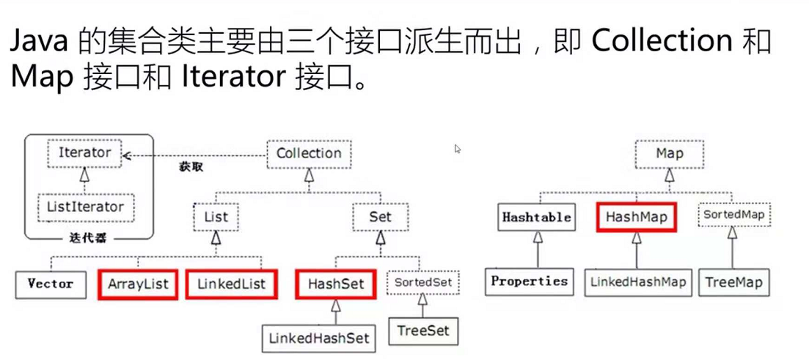

[TOC]

## java常用集合

### Collection&lt;E&gt;和Map&lt;K, V&gt;

集合是用来保存多个对象的一种容器，java提供了一系列API用来操作集合（包括基本的增删改查），java中集合框架的顶级接口有`Collection<E>`和`Map<E>`两个。

* `Collection<E>`：用于保存单个对象的集合顶级接口，是单列集合，它继承用于迭代的`Iterable<E>`接口，其下有两个常用的子接口`List<E>`和`Set<E>`。

* `Map<K, V>`：用于保存键值对的集合顶级接口，是双列集合，其常用的实现类有`HashMap`和`TreeMap`。

### List&lt;E&gt;和Set&lt;E&gt;

* `List<E>`: **有序**的 collection（也称为*序列*）。此接口的用户可以对列表中每个元素的插入位置进行精确地控制。用户可以根据元素的整数索引（在列表中的位置）访问元素，并搜索列表中的元素。同时，允许用户存储**重复**的元素。它的常用实现类有`ArrayList`和`LinkedList`
  - `ArrayList`：底层实现是数组，可以利用索引访问元素，因此查询速度较快，但增删需要移动数组中的元素位置，从而会导致增删速度慢。此类线程不安全，与它功能相似的线程安全的集合是`Vector`
  - `LinkedList`：底层实现是链表，特点与`ArrayList`相反，增删快、查询慢。（线程不安全）
* `Set<E>`：一个不包含重复元素的 collection，并且是无序的。它的常用实现类有`HashSet`和`TreeSet`两种
  - `HashSet`：底层实现是哈希表，是HashMap的一个实例（HashSet内部就是使用HashMap实现，只不过HashSet里面的HashMap所有的value都是同一个Object而已），允许存储`null`值，不保证迭代的顺序，它的子类`LinkedHashSet`可以保留数据存放的先后顺序。常用的基本操作包括 `add`、`remove`、`contains` 和 `size`，线程不安全。
  - `TreeSet`：底层实现是二叉树，使用元素的自然顺序对元素进行排序，继承`SortedSet`接口，或者根据创建 set 时提供的 `Comparator` 进行排序，具体取决于使用的构造方法，线程不安全。

### HashMap<K, V>和TreeMap<K, V>

* `HashMap<K, V>`：基于哈希表的 `Map` 接口的实现，底层是数组加链表的结构。`HashMap` 的实例有两个参数影响其性能：*初始容量* 和*加载因子*。*容量* 是哈希表中桶的数量，初始容量只是哈希表在创建时的容量。*加载因子* 是哈希表在其容量自动增加之前可以达到多满的一种尺度。默认初始容量为16，加载因子为0.75。

  HashMap与HashTable的区别：

  - HashMap线程不安全，速度快；HashTable线程安全，速度慢。

  - HashMap允许存储`null`值、`null`键；HashTable不允许存储`null`值、`null`键。

    参考资料：[HashMap和Hashtable的区别](http://www.importnew.com/7010.html)

  HashMap的存储原理：

  - 先计算hash然后通过hash与table.length取模计算index值，其中，当length为2的整数幂时，index = hash%length = hash & (length-1)

  - 然后将key放到table[index]位置，当table[index]已存在其它元素时，会在table[index]位置形成一个链表，，将新添加的元素放在table[index]，原来的元素通过Entry的next进行链接

  - 以链表形式解决hash冲突问题，当元素数量达到临界值(capactiy*factor)时，则进行扩容

  - 删除重复元素

    参考资料：[HashMap的实现原理和底层数据结构](https://blog.csdn.net/u011202334/article/details/51496381)

* `TreeMap<K, V>`: 底层实现是二叉树，使用元素的自然顺序对键值Key进行排序，继承`SortedMap`接口。

